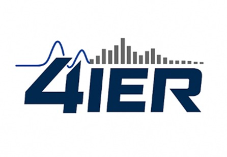

<p align="center">
  
</p>

# HMI For Prosthetic Limb (4IER)

Welcome to the **4IER Human-Machine Interface (HMI) for Prosthetic Limb** repository. This project is a cutting-edge biomedical instrumentation and machine learning platform designed to capture electromyography (EMG) signals from muscles, process and filter them in real-time, classify gestures using tiny machine learning (TinyML), and control prosthetic limb actuators (servos) via high-performance microcontrollers.

---

## 🚀 System Architecture

The overall system architecture is split into three main physical nodes cooperating in real-time:

```text
[ Muscle / Electrode sEMG ] 
      │
      ▼ (Analog Front-End Acquisition)
[ Signal Processor ESP32 (Transmitter) ] ── (TinyML Random Forest Inference)
      │
      ▼ (ESP-NOW Protocol, ~12.5 ms Step Delay)
[ Receiver ESP32 ] ── (Wireless Packet Capture & Echo Latency Test)
      │
      ▼ (UART Protocol: [0xAA][prediction][0x55])
[ STM32 Controller ] ── (High-Frequency PWM Control for Prosthetic Servos)
```

---

## 📂 Repository Structure

* **`Signal Processor ESP32 Debugging Channels`**  
  Contains the transmitter ESP32-S3 source code configured for 3-channel analog acquisition (GPIO 4, 5, 6), notch filtering (50 Hz), moving-average low-pass FIR filtering, 18-feature sliding-window extraction, real-time TinyML (Random Forest) inference, and ESP-NOW packet broadcasting.
* **`Receiver ESP32 Source Code`**  
  Contains the receiver ESP32 source code that receives the classified gestures over ESP-NOW, immediately forwards them to the STM32 via high-speed UART, and echoes back the packets for round-trip latency (Ping-Pong) performance metrics.
* **`STM32 Source Code`**  
  Contains the high-performance STM32 HAL-based C code that receives [0xAA][payload][0x55] frames via UART Rx interrupts, parses the gesture ID, and drives prosthetic servos using multiple hardware PWM timers.

---

## ⚡ Key Highlights
* **Real-time Performance:** Extremely low processing step delay of **12.5 ms** (25 samples at 2 kHz).
* **TinyML Classification:** 6-gesture classification model (Rest, Biceps, Wrist Rest, Wrist Bend, Grasp, Release) running directly on the ESP32-S3.
* **Electrical Safety:** Designed in compliance with **IEC 60601-1** standards, utilizing floating battery-powered nodes and high-impedance biopotential detection lines to guarantee sub-nanoampere patient safety.

---

## 📱 Repository QR Access

Scan the QR code below to access the repository on your mobile device:

<p align="center">
  
</p>
